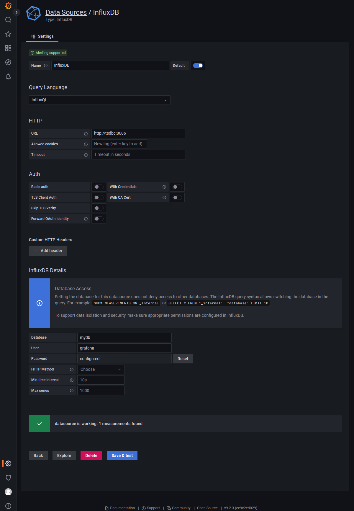

# How to set up a local grafana+influx dev environment

## Step 1: Review the `.env` file
Here the initial grafana credentials for the admin account are set.
Further in this document, we assume that both the username and password are `grafana`. When reproducing the steps, change accordingly.

## Step 2: Start the docker enviornment
```
docker compose up -d
```

## Step 3: Initialize the influx database

- First, connect into the (running) container with
```
docker exec -it tsdbc bash
```
- Next, open the influx cli. [In the initial state, it will just accept the creation of a new user.](https://docs.influxdata.com/influxdb/v1.8/administration/authentication_and_authorization/). This is done by
```
influx -precision rfc3339
```
from within the container.
- Next, create the initial user according to the credentials set in the `.env`, i.e.
```
CREATE USER grafana WITH PASSWORD 'grafana' WITH ALL PRIVILEGES;
```
- Now, we have to exit and reenter as a admin. So after exiting the influx cli, reenter with
```
influx -username grafana -password grafana -precision rfc3339
```
- Lastly, we have to initialize the Database. Furthermore, we can check whether everything worked by looking at the users and databases available
```
CREATE DATABASE mydb;
SHOW DATABASES;
SHOW USERS;
```
- Optional but recommended: Add at least one sample data. This makes Grafana able to check whether the connection works. In order to do that, just
```
USE mydb;
INSERT cpu,host=serverA,region=us_west value=0.64
```
- Now you can quit out of the container, the database should be set up properly!

## Step 4: Add the Database to Grafana
Open grafana at port `3000`, login with the credentials set in the `.env` file. Next, add a data source. Use InfluxDB with InfluxQL. Should look something like that:



The username and password are the same ones used in Step 3.

After that, use `Save & Test` and it should (hopefully) work! If not, please open an issue.
